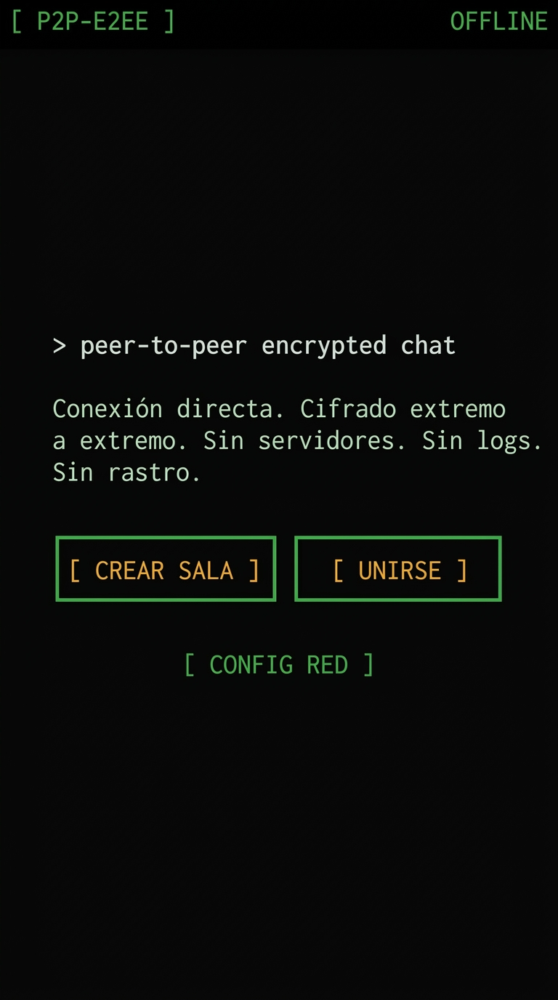
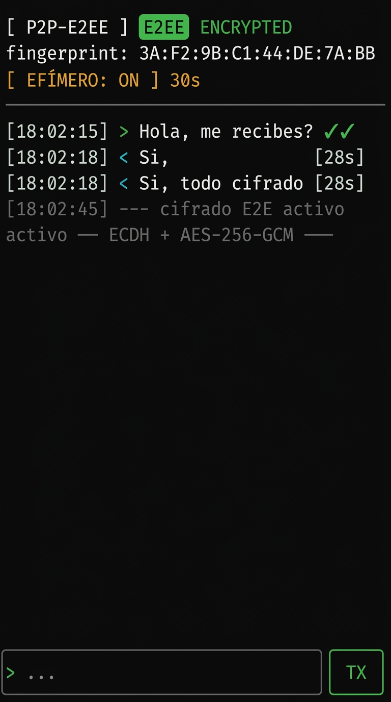

# [ PAWN ]

> Conexión directa. Cifrado extremo a extremo. Sin servidores. Sin logs. Sin rastro.

Chat peer-to-peer encriptado en un único archivo HTML. Comunicación directa entre navegadores mediante WebRTC DataChannel con cifrado de extremo a extremo usando ECDH + AES-256-GCM a través de la Web Crypto API nativa del navegador.



---

## ⚡ Características

- **🔒 Cifrado E2E real** — ECDH P-256 (intercambio de claves) + AES-256-GCM (cifrado de mensajes) + HKDF-SHA256 (derivación)
- **🔗 P2P directo** — WebRTC DataChannel, sin servidores intermedios
- **📄 Un solo archivo** — Todo en `p2p-chat.html`, sin dependencias externas
- **💀 Mensajes efímeros** — Autodestrucción configurable (10s / 30s / 1min / 5min)
- **✓✓ Estado de entrega** — Confirmación de recepción en tiempo real
- **🗜️ Tokens comprimidos** — Compresión Deflate nativa para tokens de conexión más cortos
- **🔄 Reconexión inteligente** — ICE restart automático + reconexión manual como fallback
- **🔑 Verificación visual** — Fingerprint de clave compartida para verificar identidad
- **⚙️ Soporte TURN** — Configuración opcional para redes con NAT simétrico (4G/5G/hotspot)
- **📱 Responsive** — Funciona en móvil y desktop
- **🖤 Estética underground** — UI terminal monospace, oscura, sin distracciones

---

## 🖥️ Capturas de Pantalla



---

## 🚀 Cómo Usar

### Requisitos
- Navegador moderno (Chrome, Firefox, Edge, Safari)
- Contexto seguro (`https://`, `localhost`, o `file://` en algunos navegadores)

### Conexión

1. **Peer A** abre `p2p-chat.html` → pulsa `[ CREAR SALA ]`
2. Espera a que se genere el token → lo copia y envía a **Peer B** por cualquier canal (WhatsApp, email, etc.)
3. **Peer B** abre `p2p-chat.html` → pulsa `[ UNIRSE ]` → pega el token → pulsa `[ PROCESAR ]`
4. **Peer B** copia su token de respuesta → lo envía de vuelta a **Peer A**
5. **Peer A** pega la respuesta → pulsa `[ CONECTAR ]`
6. 🔐 **Chat cifrado activo** — verificad que el fingerprint coincide en ambos lados

### Redes problemáticas (4G/5G/hotspot/corporativas)
Si la conexión directa falla:
1. Pulsa `[ ⚙ CONFIG RED ]` en la pantalla de inicio
2. Introduce la URL de un servidor TURN y credenciales
3. Opcionalmente marca `FORZAR RELAY` para ocultar tu IP
4. Ambos peers deben configurar el mismo TURN antes de conectar

---

## 📖 Manual de Funciones

### Cifrado
| Función | Descripción |
|:---|:---|
| **ECDH P-256** | Genera un par de claves efímeras por sesión. La clave privada nunca se transmite |
| **AES-256-GCM** | Cifra cada mensaje con un IV único de 96 bits. Incluye autenticación (AEAD) |
| **HKDF-SHA256** | Deriva la clave simétrica a partir del secreto compartido ECDH |
| **Fingerprint** | Hash SHA-256 del secreto compartido (8 primeros bytes). Verificación visual anti-MITM |
| **Verificación SAS** | Secuencia de 7 emojis únicos derivados criptográficamente del secreto compartido para confirmación visual/verbal rápida |
| **Anti-tampering** | Hash SHA-256 en tiempo real del código HTML de la aplicación para certificar que el archivo no ha sido alterado |

### Mensajes efímeros
- Activado por defecto (30 segundos)
- Toggle: `[ EFÍMERO: ON/OFF ]` en la barra superior del chat
- Selector de tiempo: 10s / 30s / 1min / 5min
- El countdown aparece junto a cada mensaje `[28s]`
- Al llegar a 0, el mensaje desaparece en ambos peers

### Estado de entrega
| Indicador | Significado |
|:---|:---|
| `✓` | Mensaje enviado |
| `✓✓` (verde) | Mensaje recibido por el peer |

### Indicador de escritura
- Muestra `--- peer escribiendo... ---` cuando el otro peer está tecleando
- Desaparece tras 2.5 segundos de inactividad

### Reconexión
**Nivel 1 — Automática (sin intervención):**
- Detecta desconexión → espera 3 segundos (cortes breves se resuelven solos)
- Si el DataChannel sigue vivo: ICE restart automático vía el propio canal
- Hasta 3 intentos automáticos

**Nivel 2 — Manual (si todo falla):**
- Panel rojo `> CONEXIÓN PERDIDA` con intercambio de tokens rápido
- Historial del chat se mantiene intacto
- Detecta automáticamente si el peer envía offer o answer

### Configuración de red (TURN)
- **Sin TURN**: Conexión directa P2P (funciona en ~80-85% de redes)
- **Con TURN**: Relay cifrado E2E (para NAT simétrico: 4G/5G/hotspot/corporativas)
- **Modo relay forzado**: Todo el tráfico pasa por TURN (oculta IP real de ambos peers)
- El servidor TURN **no puede leer los mensajes** — están cifrados con doble capa (AES-256-GCM + DTLS)

### Notificaciones
- **Tab inactivo**: El título muestra `[3] [ PAWN ]` con el contador de mensajes no leídos
- **Vibración**: Vibración breve en dispositivos móviles al recibir mensaje

---

## 🔐 Arquitectura de Seguridad

```
Mensaje de texto plano
    ↓
Capa 1: Cifrado aplicación (AES-256-GCM — Web Crypto API)
    ↓
Capa 2: Cifrado transporte (DTLS 1.3 — nativo WebRTC)
    ↓
Transmisión P2P directa (UDP)
```

### ¿Por qué doble capa?
- **Capa 1** protege contra: servidor TURN comprometido, señalización manipulada, MITM en el transporte
- **Capa 2** protege contra: interceptación de red estándar, sniffing de paquetes

### Filosofía zero-server
- Sin servidor de señalización → sin logs de conexión
- Sin servidor de mensajes → sin almacenamiento de datos
- Sin servidor de identidad → sin base de datos de usuarios
- Las claves viven solo en RAM del navegador → se destruyen al cerrar la pestaña

---

## 📋 Historial de Releases

### v0.3 — Seguridad Avanzada (Fase 4)
- 🛡️ **Verificación SAS (Short Authentication String)**: Emojis derivados de los bytes 8-14 del secreto compartido ECDH para comprobación visual anti-MITM.
- 🔍 **Anti-tampering en tiempo real**: Cálculo y visualización automática del hash SHA-256 del código HTML para verificar integridad.
- 🌐 **Soporte TURN dedicado y probado**: Despliegue de coturn propio en VPS con política zero-logs.

### v0.24 — Servidor TURN Propio
- Despliegue y configuración de `coturn` en VPS privado con política zero-logs.
- Fichero de referencia rápida `turn-test.txt`.

### v0.23 — Renombrado Oficial a PAWN
- Rebranding completo de la aplicación a **`[ PAWN ]`**.

### v0.22 — Documentación y Capturas
- Creación de `README.md` exhaustivo con arquitectura, manual y capturas.

### v0.21 — Soporte TURN
- Panel `[ ⚙ CONFIG RED ]` para configurar servidor TURN
- Detección de NAT simétrico con mensaje informativo
- Opción de forzar modo relay para ocultar IP

### v0.2 — Fase 2 Completa
- 🗜️ Compresión de tokens SDP (Deflate nativo, ~40-60% más cortos)
- ✓✓ Estado de entrega (enviado / recibido)
- 🔄 Reconexión inteligente en 2 niveles (automática + manual)
- 💀 Mensajes efímeros con countdown (activados por defecto, 30s)
- ✏️ Indicador de escritura
- 📌 Notificación en título de pestaña
- 🖤 UI underground: monospace, tema oscuro, sin animaciones

### v0.1 — Version Beta
- Conexión WebRTC P2P con señalización manual (copy-paste)
- Cifrado E2E: ECDH P-256 + AES-256-GCM + HKDF-SHA256
- Intercambio de claves por DataChannel
- Verificación visual por fingerprint
- UI responsive con tema oscuro

---

## 🗺️ Roadmap

### Fase 4 — Seguridad Avanzada
- [x] Verificación SAS (código/emojis para confirmar identidad anti-MITM)
- [x] Anti-tampering (hash de integridad del HTML)
- [x] Relay TURN privado opcional (protección contra NAT simétrico y ocultación de IP)
- [ ] Double Ratchet (forward secrecy — rotación per-message)

---

## ⚙️ Servidores TURN Gratuitos

Si necesitas TURN para redes con NAT simétrico:

| Proveedor | Límite gratis | Registro |
|:---|:---|:---|
| **Cloudflare Calls** | 1 TB/mes | Sí (con tarjeta) |
| **Metered Open Relay** | 20 GB/mes | Sí (sin tarjeta) |
| **Xirsys** | Trial 30 días | Sí |
| **Self-hosted (coturn)** | Ilimitado | VPS desde ~3€/mes |

### Metered Open Relay (más rápido para empezar)
```
URL:      turn:openrelay.metered.ca:443
Usuario:  openrelayproject
Password: openrelayproject
```

---

## 📜 Licencia

Proyecto personal. Código abierto.
